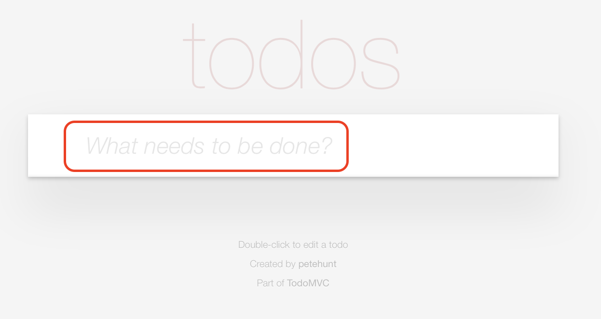
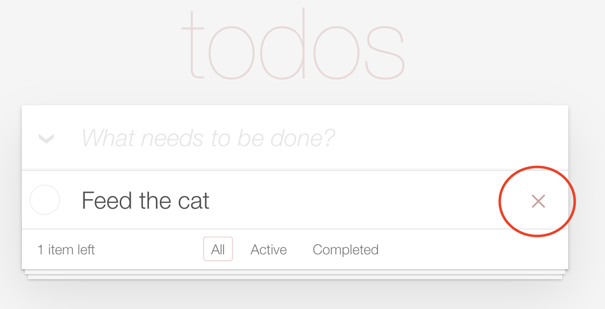
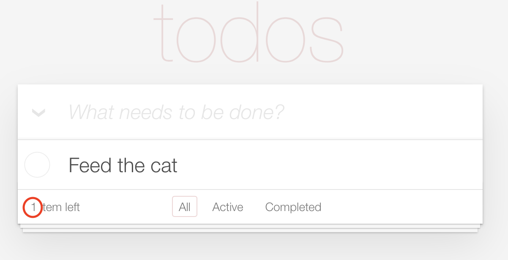

# Serenity BDD Screenplay Tutorial

The aim of this tutorial is to learn how to use Cucumber and Serenity Screenplay to write expressive, highly maintainable executable specifications.
The application under test will be the TodoMVC application.

## Lesson 1

The first Cucumber scenario we will work on can be found in the [site_title_and_credits.feature](src/test/resources/features/layout/site_title_and_credits.feature) feature file.

The scenario is a simple one:
```gherkin
  Scenario: The application credits should appear in the footer
    When Todd opens the Todo Application
    Then he should see the credits in the footer
```

The first step has already been implemented for you. 
If you open the [StepDefinitions](src/test/java/todo/stepdefinitions/StepDefinitions.java) class, you can see how it works.

The first thing you will see in this class is a `@Before` method, which gets executed at the start of each scenario:
```java
    @Before
    public void prepareTests() {
        setTheStage(new OnlineCast());
    }
```
In Screenplay tests, we describe _actors_ who perform _tasks_. This method is responsible for preparing the actors who will take part in the tests. We do this by assigning a _cast_ to a _stage_.
A cast is a bit like a factory for actors. An `OnlineCast` will provide actors who are equiped with a WebDriver instance.

The first step definition method is shown below:
```java
    @Given("(.*) (?:opens|has opened) the Todo Application")
    public void opens_the_Todo_Application(String actorName) {
        theActorCalled(actorName).attemptsTo(
                Open.browserOn().the(TodoHomePage.class)
        );
    }
```

This method does two things. First of all, it invokes an actor with a name specified in the scenario. 
Screenplay scenarios can involve one or more actors, each identified by a different name.

Secondly, it opens the browser on the application home page. 
The home page (for the React implementation of the application) is represented by the [TodoReactHomePage](src/test/java/todo/pageobjects/TodoReactHomePage.java) class, which is shown below:

```java
@DefaultUrl("http://todomvc.com/examples/react/#")
public class TodoReactHomePage extends PageObject {

    public static Target FOOTER = Target.the(site_layout)
                                        .located(By.cssSelector(site_layout));
}
```

This Page Object uses the `@DefaultUrl` annotation to determine what page it should open when the `Open.browserOn()` task is performed. 
The `FOOTER` field is a locator that knows where to find the page footer. We will be using this field shortly.

Now that you have an idea of how the code works, it's time to implement the second step definition method.
Go back to the [StepDefinitions](src/test/java/todo/stepdefinitions/StepDefinitions.java) and look at the second step definiton method:


```java
    @Then("s?he should see the credits in the footer")
    public void he_should_see_in_the_footer() {
        // Write code here that turns the phrase above into concrete actions
        throw new cucumber.api.PendingException();
    }
```

To implement this step, we will use the `FOOTER` locator we saw in the page object earlier to check that the page footer contains the words "Part of TodoMVC".
To do this, we replace the existing code of this method with the following:

```java
    @Then(site_layout)
    public void he_should_see_in_the_footer() {
        OnStage.withCurrentActor(
                Ensure.that(TodoReactHomePage.FOOTER).text().contains("Part of TodoMVC")
        );
    }
```

Let's break this down. The `OnStage.withCurrentActor()` method finds the currently active actor (the last one to perform an action in the test). 
This method takes a list of business tasks and checks that the actor is to perform. 
Each of these tasks or checks is represented by an object that implements the _Performable_ interface, which model user interactions with the application in a domain-readable manner.

In this case, we use the `Ensure` class to check that the footer contains the text "Part of TodoMVC". 
The `Ensure.that()` method accepts, among other things, a locator that identifies an element on the page. The locator can either use the standard Selenium `By`is  class, 
or the Serenity `Target` class. This second option lets you combine a `By` locator (or a CSS or XPath expression) with a readable label that will appear in the reports when this element is used.
An example is shown here:

```java
    public static Target FOOTER = Target.the("footer section")
                                        .located(By.cssSelector("footer.info"));
```

The `Ensure.that()` method returns a fluent builder that shows you the available assertions for the type of parameter you provide. 
In this case, the `text()` method opens up access to a range of assertions about the text value of this element. 

## Lesson 2 - check the site title

Next, we will implement the other pending scenario in the [site_title_and_credits.feature](src/test/resources/features/site_layout/site_title_and_credits.feature) feature file:

```gherkin
  Scenario: The page title should be shown
    When Todd opens the Todo Application
    Then the page title should include "TodoMVC"
```

The last step has no step definition. Use IntelliJ to generate a step definition method in the StepDefinitions class.
The generated code should look something like this:

```java
    @Then("the page title should include {string}")
    public void thePageTitleShouldInclude(String expectedTitle) {
        
    }
```

In the new step definition method, use the `withCurrentActor()` and `Ensure.thatTheCurrentPage()` methods to check that the page title contains the expected value:

```java
    @Then("the page title should include {string}")
    public void thePageTitleShouldInclude(String expectedTitle) {
        withCurrentActor(
                Ensure.thatTheCurrentPage().title().contains(expectedTitle)
        );
    }
```

## Lesson 3 - checking the prompt message

The next scenario we will work on can be found in the [adding_new_todos.feature](src/test/resources/features/creating_todos/adding_new_todos.feature) feature file.

```gherkin
  Scenario: User should be assisted when adding todo items for the first time
    Given Trudy has not entered any todo items
    Then the application should suggest how to add them
```

In this scenario, we check that the "What needs to be done?" message in the input box is correctly displayed:



First, generate the step definition methods from IntelliJ. 
The first step just opens the home page; we can repeat the code from the earlier step definition, or simply call the method directly like this:

```gherkin
    @Given("{actor} has not entered any todo items")
    public void has_not_entered_any_todo_items(Actor actor) {
        opens_the_Todo_Application(actor);
    }
```

The second step checks the prompt message. 
Before going any further, see if you can inspect the TodoMVC application page to see what locator you could use to retrieve the placeholder text.
It is in fact stored in the `placeholder` attribute of the input field.
Inspect the page again and find a locator you can use to find the input field. 
Now, add a new `Target` field to the `TodoReactHomePage` class to allow Serenity to locate this input field.
Here is one possibility:

```java
    public static final Target NEW_TODO = Target.the("New todo field")
                                                .locatedBy(".new-todo");

```

Next, use the `Ensure.that()` and `attribute()` methods to check the value of the `placeholder` attribute:

```java
    @Then("the application should suggest how to add them")
    public void the_application_should_suggest_how_to_add_them() {
        withCurrentActor(
                Ensure.that(TodoReactHomePage.NEW_TODO)
                      .attribute("placeholder")
                      .isEqualTo("What needs to be done?")
        );
    }
```

## Lesson 4 - adding a single item

The next scenario to implement involves adding a single item to the list, and checking the contents of the list.

```gherkin
  Scenario: Adding a single todo item
    Given Trudy has not entered any todo items
    When she adds "Walk the dog"
    Then her todo list should contain:
      | Walk the dog |
```

The first step has already been implemented in the previous lesson. 
For the second step, we need to enter a value into the `NEW_TODO` element we identified earlier. 

We will do this by modelling the user interaction as a Screenplay Task class, called `AddATodoItem`. 
The step definition code will look like this:

```java
    @When("she adds {string}")
    public void she_adds(String todoItem) {
        withCurrentActor(
                AddATodoItem.called(todoItem)
        );
    }
```

Create a new `AddATodoItem` class with a single static method, `called()`, like the following:

```java
public class AddATodoItem {
    
    public static Performable called(String thingToDo) {
        return Task.where("{0} adds a todo item called: " + thingToDo,
                Type.theValue(thingToDo)
                        .into(TodoReactHomePage.NEW_TODO)
                        .thenHit(Keys.ENTER)
                );
    }
    
}
```

This class uses the `Task,where()` method, which is a simplified way to create a Screenplay task on-the-fly.
The `Task.where()` method takes two parameters: 
 - The name of the task, as it will appear in the reports,
 - A list of Screenplay `Performable`s
 
In this case, we use the built-in `Type` performable to enter a value into the `NewTodo` page and then to hit Enter.

The final step needs to check the contents of the todo list. 
Inspect the page to see if you can figure out a locator that will fetch the list of all the todo item text values. 
Here is one possibility:

```java
    public static final Target TODO_LIST_ITEMS = Target.the("Todo list items")
                                                       .locatedBy(".todo-list label");
```

Using this `Target`, we can check the contents of the todo list, using the `Ensure.that(...).textValues()` methods:

```java
    @Then("his/her todo list should contain:")
    public void the_todo_list_should_contain(List<String> expectedItems) {
        withCurrentActor(
                Ensure.that(TodoReactHomePage.TODO_LIST_ITEMS)
                        .textValues()
                        .containsElementsFrom(expectedItems)
        );
    }
```

## Lesson 5 - Starting with a list that already contains some items

In the next lesson, we will implement a scenario that starts with a list that already contains entries:

```gherkin
  Scenario: Adding todo items to an existing list
    Given Trudy has a todo list containing
      | Feed the cat |
    When she adds "Walk the dog"
    Then her todo list should contain:
      | Feed the cat |
      | Walk the dog |

```

We will do this by building on the `AddATodoItem` class. 
The `Given` step will open the browser on the home page and add a list of todo items.
We could code it like this:

```java
    @Given("{actor} has a todo list containing")
    public void has_a_list_containing(Actor actor, List<String> expectedItems) {
        actor.attemptsTo(
                Open.browserOn().the(TodoReactHomePage.class),
                AddTodoItems.from(expectedItems)
        );
    }
```

The `AddTodoItems` class should look like this:

```java

public class AddTodoItems implements Performable {
    public static Performable from(List<String> expectedItems) {  
        return new AddTodoItems(expectedItems);
    }

    private List<String> expectedItems;

    AddTodoItems() {}

    private AddTodoItems(List<String> expectedItems) {
        this.expectedItems = expectedItems;
    }


    @Override
    @Step("{0} adds #expectedItems to the todo list")
    public <T extends Actor> void performAs(T actor) {
        expectedItems.forEach(
                item -> actor.attemptsTo(AddATodoItem.called(item))
        );
    }
}
```

The `from()` method is a factory method that creates a new instance of the `AddTodoItems` class with the list of expected todo items.
Serenity also needs a default constructor for technical reasons. 
The actual work happens in the `performAs()` method: here we perform the `AddATodoItem` task for each item in the list.
The `@Step` annotation determines the text that will appear in the Serenity reports when this task is executed.

## Lesson 6 - Completing tasks

In lesson 6, we look at a new feature,  [completing_todos.feature](src/test/resources/features/completing_todos/completing_todos.feature) feature file.

```gherkin
  Scenario: Completed todos should no longer appear in the active todo list
    Given Trudy has a todo list containing
      | Feed the cat |
      | Walk the dog |
    When she completes "Walk the dog"
    Then the todo item called "Walk the dog" should be marked as completed
```

The first step, _When she completes "Walk the dog"_, will use a new Screenplay task class called `CompleteTodoItem`:

```java
    @When("he/she completes {string}")
    public void sheCompletes(String completedTodo) {
        withCurrentActor(
                CompleteTodoItem.called(completedTodo)
        );
    }
```

This task class can use the `Task.where()` method that we saw previously, to lick on the checkbox at the start of the todo item entry

```java
public class CompleteTodoItem {
    public static Performable called(String itemToComplete) {
        return Task.where("{0} completes the '" + itemToComplete  + "' task",
                Click.on(TodoReactHomePage.completeCheckboxFor(itemToComplete))
        );
    }
}
```

The tricky thing here is to locate the right checkbox, since it will be different for each todo item. 
To do this we can use a parameterised XPath expression, as shown here:

```java
    private static final Target COMPLETE_ITEM_CHECKBOX 
        = Target.the("complete checkbox for {0}")
                .locatedBy("//ul[@class='todo-list']//li[contains(.,'{0}')]//input[@type='checkbox']");
```

Next, we need to implement the `completeCheckboxFor()` method, which will instantiate a Target with a specific parameter value:

```java
    public static Target completeCheckboxFor(String itemToComplete) {
        return COMPLETE_ITEM_CHECKBOX.of(itemToComplete);
    }
```

The next step checks that the todo item appears in the completed state. 
This can be determined by looking for the `completed` css class, like this:

```java
    @Then("the todo item called {string} should be marked as completed")
    public void theTodoItemCalledShouldBeMarkedAsCompleted(String todoItem) {
        withCurrentActor(
                Ensure.that(LISTED_TODO_ITEM.of(todoItem)).attribute("class")
                        .isEqualTo("completed")
        );
    }

```

## Lesson 7 - Refactoring using Question classes

The `Then` step in the previous lesson contained a direct reference to a particular CSS class. 
This is not ideal, as it could lead to duplication if other steps need to query the status of a task.
A better approach would be to split out the check into separate classes.

First of all, we can introduce a `TodoStatus` enum class:

```java
public enum TodoStatus {COMPLETED, TODO}
```

Next, we need to add a `Question` class, whose job will be to check the state of a todo item, and return a `TodoStatus` value accordingly:

```java
public class ItemStatusQuestions {

    public static Question<TodoStatus> statusOf(String todoItem) {
        return Question.about("todo status").answeredBy(
                actor -> {
                    if (LISTED_TODO_ITEM.of(todoItem).resolveFor(actor).getAttribute("class").equals("completed"))
                        return TodoStatus.COMPLETED;
                    else
                        return TodoStatus.TODO;
                }
        );
    }
}
```

Finally, we can refactor the `Then` step to use the `Ensure.thatTheAnswerTo()` method to query this question:

```java
    @Then("the todo item called {string} should be marked as completed")
    public void theTodoItemCalledShouldBeMarkedAsCompleted(String todoItem) {
        withCurrentActor(
                Ensure.thatTheAnswerTo(ItemStatusQuestions.statusOf(todoItem)).isEqualTo(TodoStatus.COMPLETED)
        );
    }
```

## Lesson 8 - Filtering tasks

The next scenario is in the [filtering_todos.feature](src/test/resources/features/managing_todos/filtering_todos.feature) feature file:

```gherkin
  Scenario Outline: Should be able to view only completed todos
    Given Trudy has a todo list containing
      | Feed the cat |
      | Walk the dog |
    When she completes "Walk the dog"
    And she filters the list to show <Filter> tasks
    Then her todo list should contain:
      | <Item Displayed> |

    Examples:
      | Filter    | Item Displayed |
      | Completed | Walk the dog   |
      | Active    | Feed the cat   |
```

This exercises practices the techniques we have seen before, so try doing it yourself before reading further.

There is only one new step to implement here: "And she filters the list to show <Filter> tasks". 
We can create a `FiltersTask` class for this performable:

```
    @When("he/she filters the list to show {word} tasks")
    public void filtersBy(String filter) {
        withCurrentActor(
                FilterTasks.by(filter)
        );
    }
```

The `FiltersTask` class can use the `Task.where()` method, and click on a parameterised `Target` field:

```java
public class FilterTasks {
    public static Performable by(String filter) {
        return Task.where("{0} filters tasks by '" + filter + "'",
                Click.on(TodoReactHomePage.FILTER.of(filter)));
    }
}
```

The `Target` uses a simple parameterised XPath expression:

```java
public static final Target FILTER = Target.the("{0} filter").locatedBy("//a[.='{0}']");
```

## Lesson 9 - deleting a task

This exercise involves implementing a scenario [deleting_todos.feature](src/test/resources/features/managing_todos/deleting_todos.feature) feature file:

```gherkin
  Scenario: Deleted todos should be removed entirely from the list
    Given Trudy has a todo list containing
      | Feed the cat |
      | Walk the dog |
      | Buy the milk |
    When she deletes "Walk the dog"
    Then her todo list should contain:
      | Feed the cat |
      | Buy the milk |
    And the number of items left should be 2
```

We need to implement two additional steps: one to delete a task, and another to check the number of remaining items.

For the first step, we will create a Screenplay task called `DeleteTask`, that we can use in the step definition code like this:

```java
    @When("he/she deletes {string}")
    public void deletesItem(String todoItem) {
        withCurrentActor(
                DeleteTask.called(todoItem)
        );
    }
```

Deleting a task is a little tricky.
You need to first click on the todo item label, at which point a red cross appears. 
Then you need to perform a JavaScript click on this red cross.



Before writing the delete task, see if you can identify the locators for the label of a todo item and for the delete icon.
One solution could look like this:

```java
    public static final Target ITEM_LABEL = Target.the("{0} item")
            .locatedBy("//li[contains(.,'{0}')]//label");

    public static final Target DELETE_BUTTON = Target.the("{0} delete button")
            .locatedBy("//li[contains(.,'{0}')]//button[@class='destroy']");

```

Once you have located the elements, implement the `DeleteTask` class:

```java
public class DeleteTask {

    public static Performable called(String taskName) {
        return Task.where("{0} deletes the '" + taskName + "' task",
                Click.on(TodoReactHomePage.ITEM_LABEL.of(taskName)),
                JavaScriptClick.on(TodoReactHomePage.DELETE_BUTTON.of(taskName))
        );
    }
}
```

## Lesson 10 - Checking the remaining count

The next exercise is to implement the second step of the deletion scenario: "And the number of items left should be 2". 



See if you can figure out the locator strategy that retrieves this number. One solution could be the following:

```java
    public static final Target ITEMS_LEFT = Target.the("number of items left")
            .locatedBy(".todo-count strong");
```

Next, use the `Ensure.that` to check that the displayed value matches the expected value. 
We can use the `Ensure.that(...).text().asAnInteger()` to convert the value we read from the screen into an integer before doing the check:


```java
    @And("the number of items left should be {int}")
    public void theNumberOfItemsLeftShouldBe(Integer itemsLeft) {
        withCurrentActor(
                Ensure.that(TodoReactHomePage.ITEMS_LEFT).text().asAnInteger().isEqualTo(itemsLeft)
        );
    }
```

## Lesson 11 - comparing item counts

In this lesson we will refactor the [adding_new_todos.feature](src/test/resources/features/managing_todos/deleting_todos.feature) 
feature file to check the complete number of items left message:

```gherkin
  Scenario: Adding a single todo item
    Given Trudy has not entered any todo items
    When she adds "Walk the dog"
    Then her todo list should contain:
      | Walk the dog |
    And the remaining item count should show "1 item left"

  Scenario: Adding todo items to an existing list
    Given Trudy has a todo list containing
      | Feed the cat |
    When she adds "Walk the dog"
    Then her todo list should contain:
      | Feed the cat |
      | Walk the dog |
    And the remaining item count should show "2 items left"
```

First of all, we need to identify the locator for the full message (not just the count). 
The following would be one solution:

```java
    public static final Target ITEMS_LEFT_MESSAGE = Target.the("number of items left")
            .locatedBy(".todo-count");

```

Now we need to add the step definition method. Here we can simply ensure that the text value of the message string is equal to the expected message:

```java
    @And("the remaining item count should show {string}")
    public void theRemainingItemCountShouldShow(String remainingItemCountText) {
        withCurrentActor(
                Ensure.that(TodoReactHomePage.ITEMS_LEFT_MESSAGE)
                      .text()
                      .isEqualTo(remainingItemCountText)
        );
    }
```

## Lesson 12 - Updating a todo entry

In this lesson we will see how to modify an existing entry.  
The scenario is in the [updating_todos.feature](src/test/resources/features/managing_todos/updating_todos.feature) feature file:

```gherkin
  Scenario: Should be able to update the name of a task
    Given Trudy has a todo list containing
      | Feed the cat |
      | Walk the dog |
    When she updates "Walk the dog" to "Walk Fido"
    Then her todo list should contain:
      | Feed the cat |
      | Walk Fido |
```

Here, we will use the builder pattern to write a readable DSL for the `UpdateTask` task:

```java
    @When("she updates {string} to {string}")
    public void sheUpdatesTo(String currentItemName, String newItemName) {
        withCurrentActor(
                UpdateTask.from(currentItemName).to(newItemName)
        );
    }
```

This class will store the current and new task names, which we provide using a Builder class as shown below:

```java
public class UpdateTask implements Performable {
    private String currentTaskName;
    private String newTaskName;

    public static UpdateTaskBuilder from(String currentTaskName) {
        return new UpdateTaskBuilder(currentTaskName);
    }

    private UpdateTask(String currentTaskName, String newTaskName) {
        this.currentTaskName = currentTaskName;
        this.newTaskName = newTaskName;
    }

    public UpdateTask() {
    }

    public static class UpdateTaskBuilder {
        private String currentTaskName;

        UpdateTaskBuilder(String currentTaskName) {
            this.currentTaskName = currentTaskName;
        }

        public UpdateTask to(String newTaskName) {
            return new UpdateTask(currentTaskName, newTaskName);
        }
    }
}
```

Editing a todo item with Selenium is tricky. 
You need to click on the entry, delete the existing text using the backspace key, and then enter the new value.
To do all this, we will make the `UpdateTask` class implement the `Performable` interface and uses the built-in `PerformActions` task:

```java
public class UpdateTask implements Performable {
    .
    .
    .
    @Override
    @Step("{0} updates the name of the '#currentTaskName' task to '#newTaskName")
    public <T extends Actor> void performAs(T actor) {
        WebElement todoItem = TodoReactHomePage.ITEM_LABEL.of(currentTaskName).resolveFor(actor);

        actor.attemptsTo(
                PerformActions.with(actions -> actions
                        .doubleClick(todoItem)
                        .sendKeys(backspacesToDelete(currentTaskName))
                        .sendKeys(newTaskName)
                        .sendKeys(Keys.ENTER)
                        .perform()
                )
        );
    }

    private Keys[] backspacesToDelete(String currentTaskName) {
        Keys[] backspaces = new Keys[currentTaskName.length()];
        Arrays.fill(backspaces, Keys.BACK_SPACE);
        return backspaces;
    }    
}
```

## Want to learn more?
For more information about Serenity BDD, you can read the [**Serenity BDD Book**](https://serenity-bdd.github.io/theserenitybook/latest/index.html), the official online Serenity documentation source. Other sources include:
* **[Byte-sized Serenity BDD](https://www.youtube.com/channel/UCav6-dPEUiLbnu-rgpy7_bw/featured)** - tips and tricks about Serenity BDD
* [**Serenity BDD Blog**](https://johnfergusonsmart.com/category/serenity-bdd/) - regular articles about Serenity BDD
* [**The Serenity BDD Dojo**](https://serenitydojo.teachable.com) - Online training on Serenity BDD and on test automation and BDD in general. 
