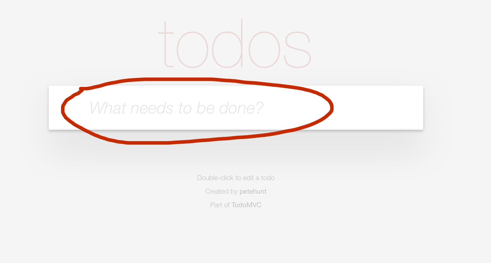

# Serenity BDD Screenplay Tutorial

The aim of this tutorial is to learn how to use Cucumber and Serenity Screenplay to write expressive, highly maintainable executable specifications.
The application under test will be the TodoMVC application,

## Lesson 1

The first scenario we will implement will simply check that application users see a meaningful prompt in the Todo input box. 



The Cucumber scenario for this requirement looks like this:

```gherkin
Feature: Adding a new todo

  Scenario: User should be assisted when adding todo items for the first time
    Given Trudy has not entered any todo items
    Then the application should suggest how to add them
```

You will find this scenario in the [adding_a_new_todo.feature](src/test/resources/features/creating_todos/adding_a_new_todo.feature) file.

At the moment, this scenario has no implementation. The first exercise involves implementing these steps to make the test pass.

### Add step definition methods


